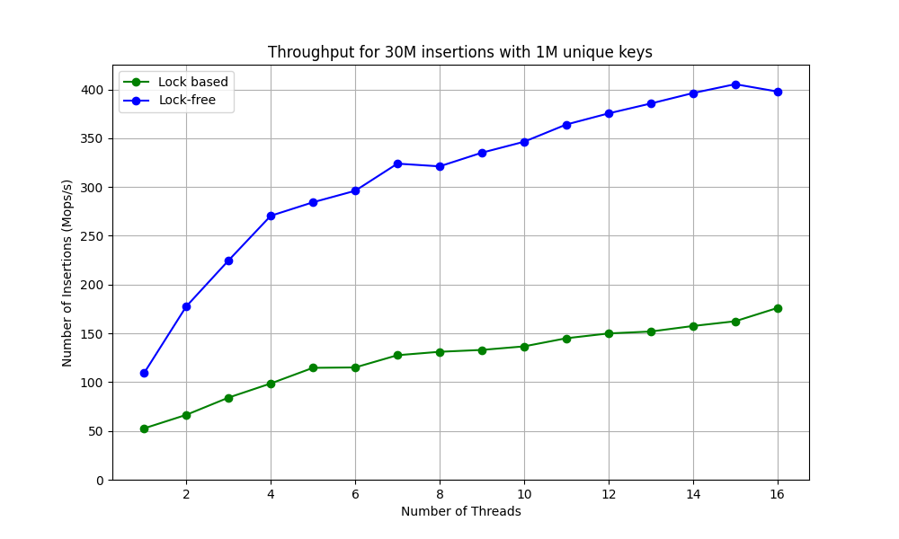
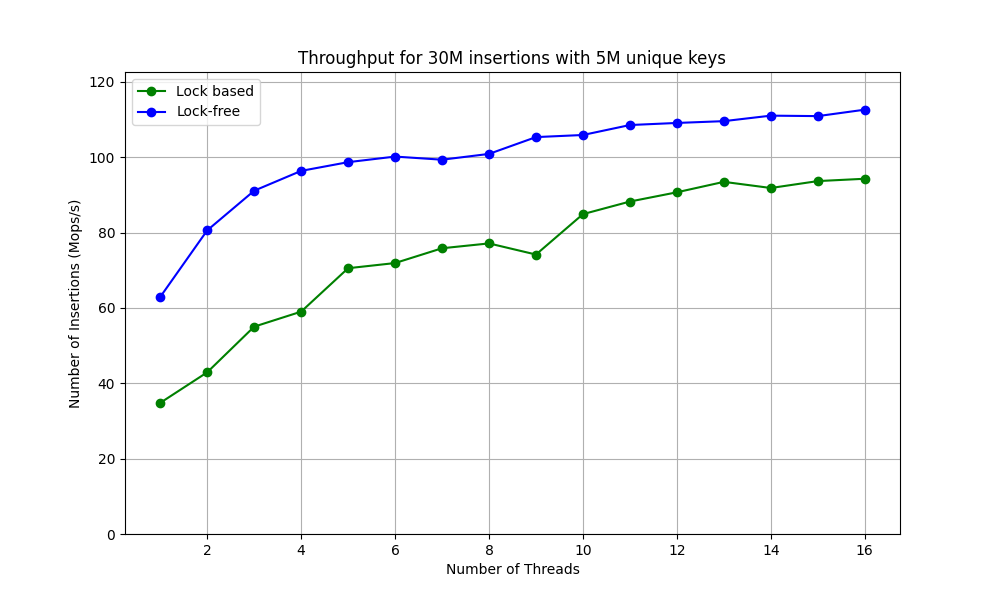
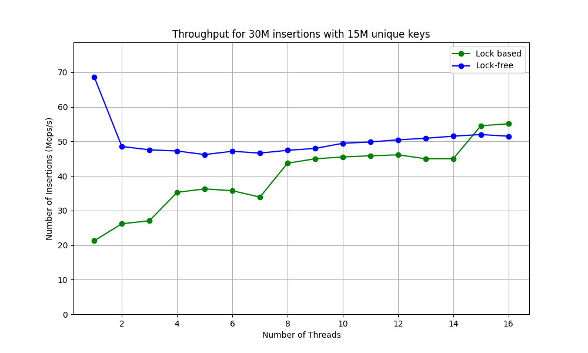

# Benchmark for lock free hashtable
In this repository, performance of lock based hash table and lock-free hash table is compared.

The lock based hash table is the one used in [FastUniq](https://github.com/matsuoka-601/FastUniq/tree/main). The table is partitioned into multiple (e.g. 512) buckets and each bucket has its own lock. If the number of buckets is much larger than the number of threads, this hash table is expected to exhibit good scalability.


The lock-free hash table is based on [The World's Simplest Lock-Free Hash Table](https://preshing.com/20130605/the-worlds-simplest-lock-free-hash-table/). In the article, a very simple lock-free hash table is implemented with only insert (and get) function using CAS (compare and swap) instruction. Implementing a resize function is a much more challenging task, so the table size is fixed in this repository.

## Benchmark
The number of insertions was fixed at 30 million, and the number of unique keys was varied to evaluate performance. Each key is 64bit random integer.

- 30 million inserts with 1 million unique keys

- 30 million inserts with 5 million unique keys

- 30 million inserts with 15 million unique keys


## How to run benchmark
Just build `bench.cpp` like below and run the executable.
```
g++ bench.cpp -O3 -fopenmp
```
You can configure following parameters. The keys to be inserted are 64-bit random integers.
- `-u` : The number of unique keys
- `-i` : The number of insertions